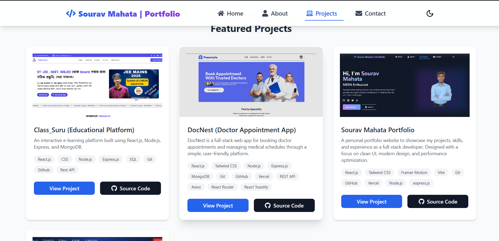

## 🌐 Personal Portfolio Website

My Personal Portfolio is a responsive and dynamic website built to showcase my projects, blogs, and skills as a Full-Stack Developer. It demonstrates modern web development techniques, animations, and an interactive interface to impress recruiters and visitors alike.

---

## ✨ Features

- **Project Showcase:** Display completed projects with descriptions, tech stack, and links

- **Blog Section:** Share technical blogs and learning experiences

- **Responsive Design:** Works seamlessly on desktop, tablet, and mobile devices

- **Animated UI:** Smooth animations using Framer Motion for modern, interactive experience

- **Contact Form:** Integrated with nodemailer for dynamic form submissions

## 🛠️ Tech Stack

Frontend: React.js, Tailwind CSS, Framer Motion

Backend: Nodemailer

Deployment: Vercel

## 👤 My Role / Contributions

- Developed this portfolio website end-to-end

- Designed and implemented a responsive and interactive frontend using React, Tailwind CSS, and Framer Motion

- Implemented a dark/light mode toggle for better user experience

- Built a backend API with Node.js, Express.js, and MongoDB for the contact form, integrating Nodemailer to automatically send confirmation emails to users

- Deployed the project on Vercel, ensuring fast load times and cross-device compatibility

- Optimized performance and UI/UX for a professional portfolio experience

---

📸 Screenshots / Demo

### Homepage

### Projects Section

### Contact Form

---

## ⚡ Challenges & Learnings

- Implemented smooth animations and interactive UI with Framer Motion

- Learned Tailwind CSS utilities for responsive and modern styling

- Built and integrated backend API for dynamic contact form management using Nodemailer to send automatic replies

- Implemented dark/light mode toggle for improved user experience

- Optimized frontend-backend interactions for seamless performance

- Gained hands-on experience deploying full-stack apps on Verce

## 📫 Contact

